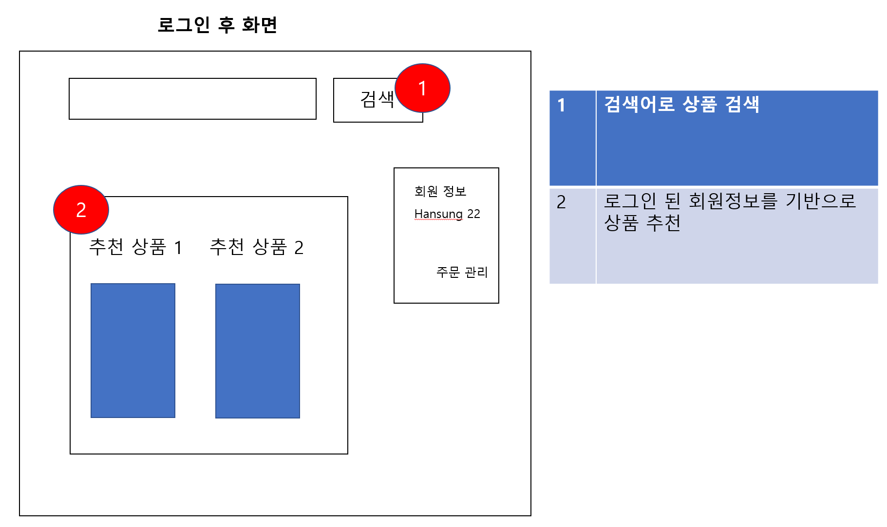
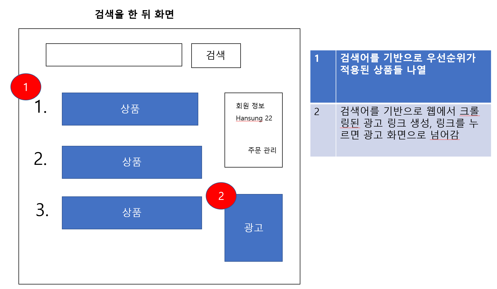

<div align=center>


</div>
<br>

# :clipboard: 구매 연계 추천 시스템 :computer:

<br>

## 목차

```
1. 서비스 소개
2. 유사 서비스
3. 오픈소스 목록
4. 오픈소스 특징 및 역할
5. 오픈소스 데이터 타입 및 라이선스
  5.1 배포 시 예상 문제
  5.2 문제에 대한 입장
6. DFD(data flow diagram)
7. 실행화면
```

<br>

## :recycle: 서비스 소개

```
  구매 연계 추천 서비스는 사용자가 웹사이트에 접속한 후 및 상품을 구매하면 사용자와 관련 있는 상품들을 추천하는
서비스이다.
  이 추천 서비스를 적용하면 고객들의 구매 서비스 만족도를 향상시킬 수 있을 뿐만 아니라 지속적인 웹사이트 이용을 유도
하여 상품 구매량 증가 및 기존 고객층 유지와 신규 고객 가입을 이끌어 최종적으로 수익이 증가하는 효과를 얻을 수 있다.
  추천 서비스는 회원제로 운영된다. 사용자는 우선 웹사이트에 접속한다. 웹사이트에 접속하면 구매 이력을 조회한 결과를
이용하여 서비스를 제공받을 수 있다. 또한 원하는 물건을 검색하여 구매를 완료하면 구매 이력 및 물건과 관련 있는 기타
물건들의 정보를 조합하여 사용자에게 맞춰진 물품들을 추천한다.
  서비스는 추천 시 여러 가지 추천 알고리즘들이 이용되어 높은 정확성을 지닌 채 상품을 추천할 수 있다.
```

<br>

## :mag_right: 유사 서비스

```
1. 쿠팡
* 유사점
  - 홈페이지 초기 화면부터 상품 추천
  - 검색시 분류기준으로 나열하여 상품 확인 가능
  - 상품 상세 페이지로 추가적으로 추천
* 차이점
  - 홈페이지 초기 화면에서 쿠팡은 특가 이벤트, 기간 이벤트로 추천하지만 본 서비스는 사용자 정보를 기반으로 추천
  - 상품 상세 페이지에서 쿠팡은 쿠팡내의 상품을 추천해주지만 본 서비스는 다른 웹 사이트의 광고를 띄움

2. 네이버
* 유사점
  - 홈 화면에서의 광고창
  - 검색어 입력시 검색어와 관련된 네이버 쇼핑 안의 상품과 외부 광고 사이트의 링크
* 차이점
  - 홈 화면에서의 광고창이 네이버는 무작위 광고지만 본 서비스에서는 사용자 정보 기반 광고
```

<br>

## :school_satchel: 오픈소스 목록

```
1. JQuery Validation
2. WordPress
3. SOLR
4. Coupang Category Recommendation API
5. React
6. OpenRefine
7. Apache Spark
8. Scrapy
9. Tensorflow
10. Tensorflow Serving
```

<br>

## :school_satchel: 오픈소스 특징 및 역할

- Apache Spark

```
- 2014년 5월 26일에 최초 출시
- SQL, 스트리밍, 머신러닝 및 그래프 처리를 위한 기본 제공 모듈이 있는 대규모 데이터 처리용 통합 분석 엔진
- 통합 컴퓨팅 엔진이며 클러스터 환경에서 데이터를 병렬로 처리
- 인메모리 처리 아키텍처
- 반복적인 처리가 필요한 작업에서 하둡보다 최소 1000배이상 빠른 속도
- 다양한 컴포넌트와 라이브러리 지원
- Scala, JAVA, Pyhon 등의 다양한 언어 기반의 고수준 API를 사용 가능
- 스트리밍, 머신러닝 등 넓은 범위의 라이브러리를 제공
- RDD는 Resilient Distributed Datasets의 줄임말로, 메모리 내부에서 데이터가 손실 시 유실된 파티션을 재연산해 복구할 수 있으며 스파크 클러스터를 통하여, 메모리에 분산되어 저장되는 데이터이다. 즉, 회복력 있는 분산 데이터이다.
```

```
사용자 DB의 구매이력과 최근항목, 제품 DB의 카테고리 및 설명을 정제한 데이터를 받아 적절한 제품을 추천
```

<br>

- Coupang Category Recommendation API
```
- 가지고 있는 상품정보(상품명, 브랜드, 속성 등)을 입력하면 해당 정보와 가장 일치하는 카테고리를 찾아서 제안해주는 서비스이다.
- 과거 등록되었던 상품의 쿠팡 카테고리를 시스템에 학습시킨 머신러닝 모델로 서비스되고 있다.
- 부정확한 정보 입력 시 정확한 카테고리가 추천되지 않을 수 있다.
```

```
사용자가 가지고 있는 제품의 데이터(사용자 프로필 데이터)로 사용자 기반 추천을 하여 추천된 카테고리 정보를 생성
```

<br>

- jquery-validation

```
-jQuery의 폼 검증 플러그인
-MIT 라이선스 적용
- 간단한 클라이언트 측 양식 유효성 검사를 쉽게 가능
- 다양한 사용자 정의 옵션 정의 가능
```

```
 아이디,비밀번호,검색어의 유효성 검사를 위해 사용
```

<br>

- solr

```
 -apache에서 만든 텍스트 검색기능 제공 오픈소스
 -apache 2.0 라이선스 적용
 - 색인과 검색을 통한 텍스트 검색 기능 제공
 - db와 연동해서 사용 가능
 - http 요청에 대한 처리와 응답을 하는 웹 기반
 - 기본적인 UI 제공
```

```
 검색을 통해 데이터를 추출하기 위해 사용
```

<br>

- Tensorflow

```
- 2015년 구글에서 공개
- 주로 Python 언어를 통해 작동됨
- 데이터가 주어졌을 때 스스로 학습하는 머신러닝 구현
- Learning to rank 알고리즘 등 다양한 알고리즘을 지원하여 그에 맞게 학습 가능
- Tensor라는 데이터 형식을 이용하여 연산 진행
- 시각화 도구인 Tensorboard를 지원하여 학습과정 추적 가능
- 지속적인 성능 개선과 수정을 통한 빠르고 안정적인 성능 지원
```

```
Tensorflow에 구현된 알고리즘 중 Learing to rank 알고리즘을 사용하여 추천 데이터들의 우선순위를 기록한 데이터 생성
```

<br>

- Tensorflow Serving

```
- Tensorflow 데이터 배포를 위해 개발
- Tensorflow 데이터에 대한 버전 관리 지원
- Tensorflow 데이터의 크기가 큰 경우 여러 개로 나누어 배포
- REST API를 지원하여 사용자에게 데이터 전달 가능
```

```
Tensorflow를 이용하여 만들어진 데이터를 사용자에게 전달하기 위해 사용됨
```

<br>

* OpenRefine

```
- 2010년 Google의 오픈 프로젝트
- 전처리를 하기 위한 데이터 랭글링(data wrangling)
- 스프레드시트 파일 포맷과 동작한다는 점에서 스프레드시트 애플리케이션과 유사하지만 보다 데이터베이스처럼 동작
- 데이터의 전반적인 경향성을 보고자 할 때 편리 
- 데이터 정제 도구 : 오류 수정, 데이터 정리
- 데이터 연계 API 및 워크플로우 기능 제공
```

```
대규모 데이터를 정제하고 다른 포맷으로 변환하는 데 사용
```

<br>

- Scrapy

```
- Python으로 작성된 오픈소스 웹 크롤링 프레임워크
- BSD-3-Cluase license
- 웹 데이터를 수집하는 것을 목표로 설계되었고, 비동기 네트워킹 라이브러리인 Twisted를 기반으로 하기 때문에 매우 우수한 성능을 발휘함
- API를 이용하여 데이터를 추출할 수 있고, 범용 웹 크롤러로 사용될 수 있음
- URL을 전달하여 원하는 데이터들만 크롤링
```

```
추천된 제품명을 웹사이트 내에서 재검색한 url을 이용해 scrapy를 통해 제품이미지,제품명,제품url을 크롤링해 사용자에게 광고를 띄워줌
```

<br>

- WordPress

```
- PHP 언어를 기반으로 작성된 오픈소스 CMS
- 템플릿 시스템 사용
- PHP와 HTML 코드 수정 없이도 다시 정리할 수 있는 위젯 포함
- 수많은 테마와 다양한 유·무료 플러그인 사용 가능
```

```
WordPress를 통하여 웹사이트를 구축
```

<br>

- React

```
- Facebook에서 주도하여 개발한 웹 어플리케이션의 UI를 효과적으로 구축하기 위해 사용하는 Javascript 기반 라이브러리
- 성능이 뛰어난 가비지 컬랙터, 메모리 관리 기능 지원
- UI 수정과 재사용성이 좋으며, 코드 가독성을 높일 수 있음
```

```
React를 통하여 사용자가 편하게 사용할 수 있는 UI 구축
```

## :school_satchel: 오픈소스 데이터 타입 및 라이선스

| open source        | input data | output data | license      |
| ------------------ | ---------- | ----------- | ------------ |
| Apache Spark       | RDD        | RDD         | Apache 2.0   |
| tensorflow         | files      | tensor      | Apache 2.0   |
| tensorflow serving | tensor     | json        | Apache 2.0   |
| OpenRefine         | json 등    | json 등     | BSD          |
| scrapy             | text       | json        | BSD-3-Clause |
| jQuery-validation  | text       | form        | MIT          |
| solr               | text       | json        | Apache 2.0   |
| Coupang Open API   | json       | json        | MIT          |
| wordpress          | text       | json        | GPLv2        |
| react              | json       | UI          | MIT          |

<br>

### 배포 시 예상 문제

* 라이선스 충돌 문제
```
   - wordpress의 GPLv2와 Apache 라이선스가 서로 충돌하는 문제가 발생함.
```

* 신규 사용자에 대한 추천 사항 문제
```
   - 신규 사용자는 검색 기록, 방문 기록 등 구체적인 서비스 사용 기록이 없어 적합한 추천이 어려울 가능성이 있음.
```

<br>

### 문제에 대한 입장

* 라이선스 충돌 문제
```
   - GPLv2의 배포 범위를 어디까지를 규정할 것인가에 따라 관점이 나뉨.
   - 본 서비스에서 wordpress의 사용 목적은 웹서버 구축.
   - 서버를 사용자들에게 직접 배포하지 않을 계획이라 충돌에 대한 문제가 없음.
```

* 신규 사용자에 대한 추천 사항 문제
```
   - 구매 기록, 최근 항목, 성별, 나이, 주소, 직업, 소속 등의 기타 데이터를 종합하여 문제에 대하여 해결 가능.
```

<br>

## :arrows_counterclockwise: 자료흐름도 (Data Flow Diagrams)

<div align=center>


</div>

<br>

## 💻 실행 화면

```
1. 아이디와 비밀번호를 입력하여 회원 여부 판별 및 아이디, 비밀번호 문자열 유효성 검사
```

<div align=center>


</div>

```
2. 회원정보를 바탕으로 맞춤화된 상품 추천 및 검색어 입력
```

<div align=center>



</div>

```
3. 검색한 후에 검색어를 바탕으로 상품들을 우선순위 반영하여 추천, 검색어에 맞는 광고 링크 생성 
```

<div align=center>



</div>
